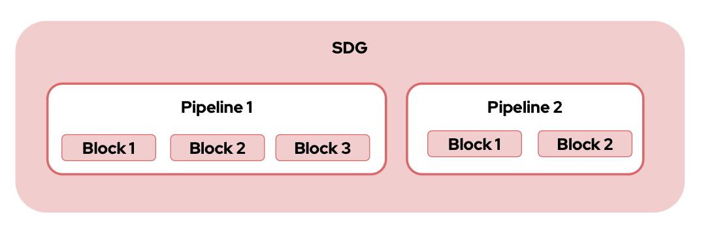

# Synthetic Data Generation for LLMs
<div align="center">
    
    <p>Image generated by DALL-E
</div>

<p align="center"><a href="https://red-hat-ai-innovation-team.github.io/">[🏠 Red Hat AI Innovation Team]</a> | <a href="https://arxiv.org/abs/2403.01081">[📄 InstructLab Paper]</a></p>

---

The SDG Framework is a modular, scalable, and efficient solution for creating synthetic data generation workflows in a “no-code” manner. At its core, this framework is designed to simplify data creation for LLMs, allowing users to chain computational units and build powerful pipelines for generating data and processing tasks.


## Core Design Principles

The framework is built around the following principles:

1. **Modular Design**: Highly composable blocks form the building units of the framework, allowing users to build workflows effortlessly.
2. **No-Code Workflow Creation**: Specify workflows using simple YAML configuration files.
3. **Scalability and Performance**: Optimized for handling large-scale workflows with millions of records.

---

## Framework Architecture



### Blocks: The Fundamental Unit

At the heart of the framework is the **Block**. Each block is a self-contained computational unit that performs specific tasks, such as:

- Making LLM calls
- Performing data transformations
- Applying filters

Blocks are designed to be:
- **Modular**: Reusable across multiple pipelines.
- **Composable**: Easily chained together to create workflows.

These blocks are implemented in the [src/instructlab/sdg/blocks](src/instructlab/sdg/blocks) directory.

### Pipelines: Higher-Level Abstraction

Blocks can be chained together to form a **Pipeline**. Pipelines enable:
- Linear or recursive chaining of blocks.
- Execution of complex workflows by chaining multiple pipelines together.

### SDG Workflow: Full Workflow Automation

Pipelines are further orchestrated into **SDG Workflows**, enabling seamless end-to-end processing. When invoking `sdg.generate`, it triggers a pipeline/ or multiple pipelines that processes data through all the configured blocks. 

---

### YAML-Based Workflow: The Flow

The YAML configuration file, known as the **Flow**, is central to defining data generation workflows in the SDG Framework. A Flow describes how blocks and pipelines are orchestrated to process and generate data efficiently. By leveraging YAML, users can create highly customizable and modular workflows without writing any code.

#### Key Features of a Flow

1. **Modular Design**: 
   - Flows are composed of blocks, which can be chained together into pipelines.
   - Each block performs a specific task, such as generating, filtering, or transforming data.

2. **Reusability**:
   - Blocks and configurations defined in a Flow can be reused across different workflows.
   - YAML makes it easy to tweak or extend workflows without significant changes.

3. **Ease of Configuration**:
   - Users can specify block types, configurations, and data processing details in a simple and intuitive manner.

---

### Sample Flow

Here is an example of a Flow configuration:

```yaml
- block_type: LLMBlock
  block_config:
    block_name: gen_questions
    config_path: configs/skills/freeform_questions.yaml
    model_id: mistralai/Mixtral-8x7B-Instruct-v0.1
    output_cols:
      - question
    batch_kwargs:
      num_samples: 30
  drop_duplicates:
    - question
- block_type: FilterByValueBlock
  block_config:
    block_name: filter_questions
    filter_column: score
    filter_value: 1.0
    operation: operator.eq
    convert_dtype: float
    batch_kwargs:
      num_procs: 8
  drop_columns:
    - evaluation
    - score
    - num_samples
- block_type: LLMBlock
  block_config:
    block_name: gen_responses
    config_path: configs/skills/freeform_responses.yaml
    model_id: mistralai/Mixtral-8x7B-Instruct-v0.1
    output_cols:
      - response
```

### Dataflow and Storage

- **Data Representation**: Dataflow between blocks and pipelines is handled using **Hugging Face Datasets**, which are based on Arrow tables. This provides:
  - Native parallelization capabilities (e.g., maps, filters).
  - Support for efficient data transformations.

- **Data Checkpoints**: Intermediate caches of generated data. Checkpoints allow users to:
  - Resume workflows from the last successful state if interrupted.
  - Improve reliability for long-running workflows.

---

## Sample usecases: 

### Knowledge generation

TODO

### Data Annotation

The following command annotates the dataset located at [datasets/emotion/seed.jsonl](datasets/emotion/seed.jsonl) using the flow defined in [src/instructlab/sdg/flows/annotation/emotion/detailed_description_icl.yaml](src/instructlab/sdg/flows/annotation/emotion/detailed_description_icl.yaml) 

#### Command to Run the Annotation Workflow

```bash
python run.py \
  --ds_path datasets/emotion/seed.jsonl \
  --save_path emotion/output.jsonl \
  --checkpoint_dir checkpoints/emotion \
  --endpoint <replace with your endpoint> \
  --flow src/instructlab/sdg/flows/annotation/emotion/detailed_description_icl.yaml \
```


#### Evaluating the Annotated Data

Once the annotation is complete, you can evaluate the results using the following Python script. The evaluation computes precision, recall, and F1-score using scikit-learn.

```python
from datasets import load_dataset
from sklearn.metrics import classification_report

def get_eval_report(ds_path):
    # Load the annotated dataset
    ds = load_dataset("json", data_files=ds_path, split="train")

    # Extract ground truth and predictions
    gt = ds["ground_truth"]
    preds = ds["output"]

    # Print the evaluation report
    print(classification_report(gt, preds))
```

Running the evaluation script on the annotated dataset should produce the following metrics:

```python
              precision    recall  f1-score   support

       anger       0.45      0.59      0.51       521
        fear       0.41      0.34      0.37       432
         joy       0.74      0.59      0.65      1316
        love       0.33      0.12      0.17       302
     sadness       0.48      0.70      0.56      1093
    surprise       0.00      0.00      0.00       128

    accuracy                           0.53      3792
   macro avg       0.40      0.39      0.38      3792
weighted avg       0.53      0.53      0.52      3792
```
